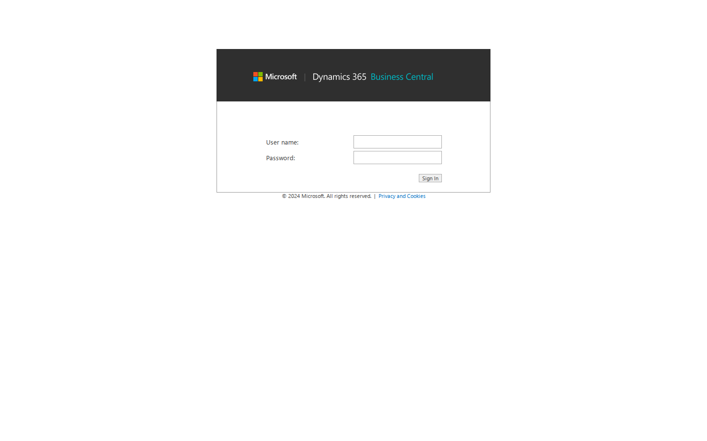
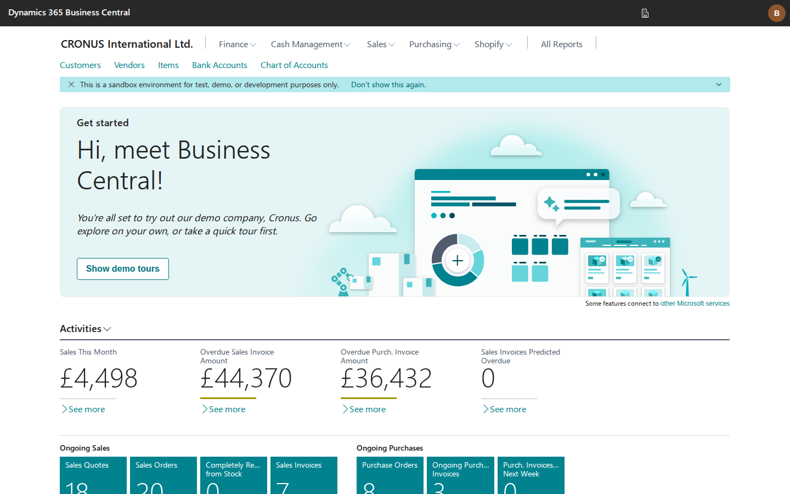
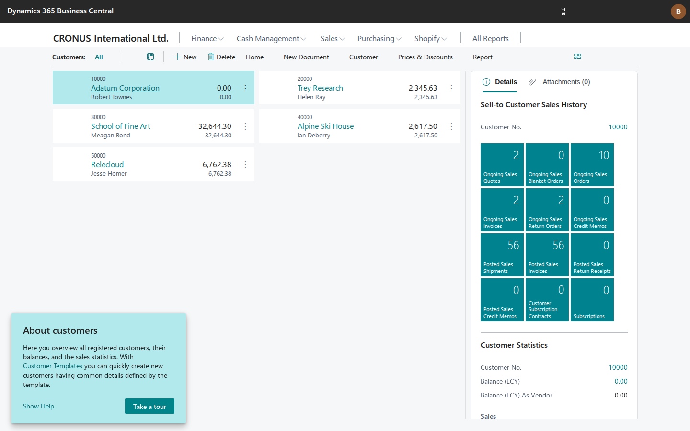
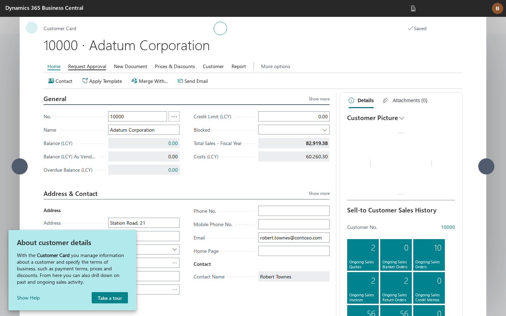

# Web Client on Linux — Proof of Concept

**Status: WORKING — intended as a dev convenience tool** (spin up a
container on Linux/macOS and do basic testing through the browser UI), not
a production deployment target. Microsoft's real Business Central web client
(`Prod.Client.WebCoreApp`, ASP.NET Core / .NET 8) runs self-hosted on Kestrel
inside the bc container, pointed at the Linux NST, and is fully usable from a
real browser: sign-in, role center with live CRONUS data, list pages, and
cards all render and respond. No protocol shim, no emulation — this is the
unmodified web server binary from the BC platform artifact, runtime-patched
the same way the NST is.

Verified on BC 28.1 (platform 28.0.51325.0) with headless Chromium via
Playwright:

| Milestone | Screenshot |
|---|---|
| (a) Sign-in page renders |  |
| (b)+(c) Login (BCRUNNER) + role center with live Activities tiles |  |
| (d) Customer List with real CRONUS rows + FactBox |  |
| (e) Customer Card with real field values |  |

## How to run

```bash
BC_WEBCLIENT=1 docker compose up -d --wait
# then browse to http://localhost:8080  (BCRUNNER / Admin123!)
```

Or start it manually inside a running container:

```bash
docker compose exec -d bc /bc/scripts/start-webclient.sh
docker compose exec bc tail -f /tmp/webclient.log
```

The host port is `${BC_WEBCLIENT_PORT:-8080}`. Everything is additive and
opt-in: with `BC_WEBCLIENT` unset, nothing about the NST boot path changes.

## Architecture

```
browser ──HTTP/WS (/csh, JSON-RPC)──▶ Prod.Client.WebCoreApp (Kestrel, :8080)
                                           │  in the same bc container
                                           ▼
                              ws://localhost:7085 (client services)
                                           │
                                        Linux NST
```

- `scripts/start-webclient.sh` stages the artifact's
  `WebClient/.../WebPublish/` publish layout into `/bc/webclient/` (writable
  copy), patches configs, creates required directories/symlinks, and execs
  `dotnet Prod.Client.WebCoreApp.dll` with the dedicated startup hook.
- `src/WebClientHook/` is a **separate** lightweight `DOTNET_STARTUP_HOOKS`
  assembly. The NST's `StartupHook` is deliberately not reused — it contains
  patches that assume the NST process (encryption provider swaps, side
  services, Cecil compiler fixes).
- The web-server↔NST channel needs nothing new: the NST's client services
  already run over Kestrel on 7085 via the HttpSys stub (exercised daily by
  `run-tests.sh`), and the web client connects to it out of the box with
  `ClientServicesCredentialType=NavUserPassword`.

## What start-webclient.sh configures (and why)

| Change | Why |
|---|---|
| `navsettings.json`: `Server=localhost`, `ServerInstance=BC`, `ClientServicesPort=7085`, `ClientServicesCredentialType=NavUserPassword`, `RequireSsl=false`, `ServerHttps=false`, `AuthenticateServer=false` | Point at the local Linux NST over plain ws:// |
| `Prod.Client.WebCoreApp.runtimeconfig.json`: `System.Globalization.UseNls=false` (+ `DOTNET_SYSTEM_GLOBALIZATION_USENLS=0`) | The shipped config forces NLS globalization, which is Windows-only |
| `hosting.json`: rewrite `urls` to the desired port | The app calls `UseUrls(hosting.json)` which **wins over `ASPNETCORE_URLS`** (shipped value is `http://*:48900`) |
| `mkdir wwwroot/Resources/ExtractedResources`, `Thumbnails`, `Resources/images/static`, `Reports` | Startup check throws `DirectoryNotFoundException` if missing (the Windows MSI creates them) |
| Lowercase symlinks in `wwwroot/js/` (`boot.js` → `Boot.js`, …) | The boot view reads script files by lowercased name; Linux is case-sensitive |
| `wwwroot/Resources/Brand` → `brand` symlink | `BrandProvider` enumerates `Resources/Brand/...`; artifact ships `brand` |
| `DOTNET_TieredCompilation=0` | **Critical.** JMP hooks get silently overwritten by Tier-1 recompilation — same invariant as the NST. Symptom was maddening: the EventLog patch worked at startup, then minutes later the original code came back and the first session-level log write killed the session thread |
| `HTTPSYS_STUB_INJECT_IDENTITY=0` | See stub changes below |
| `DOTNET_STARTUP_HOOKS=/bc/webclient-hook/WebClientHook.dll` | Replaces the NST hook for this process |

## WebClientHook patches

| # | Target | Problem on Linux | Fix |
|---|---|---|---|
| W1 | `Microsoft.Extensions.Logging.EventLog` `EventLogLoggerProvider.CreateLogger` | Web server registers a Windows EventLog logging provider unconditionally; first logger creation throws `PlatformNotSupportedException` inside `WebHostBuilder.Build()` | JMP-hook to return `NullLogger.Instance` |
| W2 | `Microsoft.Dynamics.Framework.UI.WebBase.FilePersistenceManager` (all 5 methods) | Resource/thumbnail persistence builds paths from hardcoded backslash constants (`"Resources\ExtractedResources\"`) | Reimplement with `\`→`/` normalization; everything funnels through this one class |
| W3 | `Microsoft.Dynamics.Nav.Types.EventLogWriter` | The embedded Nav client runtime's background event queue calls `System.Diagnostics.EventLog` and aborts the process | Replace static writer instance with a `DispatchProxy` no-op (same as NST Patch #4; JMP unreliable here due to inlining) |
| W4 | `Microsoft.Dynamics.Framework.UI.Web.FileHelper.GetSymbolicLinkTarget` | P/Invokes kernel32 `CreateFile`/`GetFinalPathNameByHandle` just to resolve symlinks for a `FileSystemWatcher` | Managed reimplementation via `FileInfo.ResolveLinkTarget` |
| W5 | (all assemblies) | Any other Win32 P/Invoke | `ResolvingUnmanagedDll` → `libwin32_stubs.so`, mirroring NST Patch #3 |
| W6 / W6b | `ConfigurationTimeZoneProvider.get_TimeZone`, `TimeZoneHelper.DetectTimeZone` | The browser's time zone is sent to the NST and serialized with `TimeZoneInfo.ToSerializedString`, which fails to deserialize on Linux for DST zones (see Time zone bug below) | Emit a round-trip-safe zone (`Etc/GMT±N` for whole-hour offsets, synthetic `UTC±HH:MM` for sub-hour) instead of an ICU zone |

### The time zone bug (most important fix for real users)

`TimeZoneInfo.FromSerializedString(TimeZoneInfo.X.ToSerializedString())` throws
`InvalidTimeZoneException` on Linux for most ICU zones that carry DST rules — a
.NET-on-Linux quirk. BC round-trips session/user time zones through exactly that
pair, so **any user whose browser is in a DST time zone (Europe, most of the US,
Australia, …) could not sign in** — `OpenConnection` died server-side before the
client loaded. The CRONUS demo DB also ships
`[User Personalization].[Time Zone] = 'Europe/Amsterdam'`, which broke even a
UTC browser on the very first login.

It took three coordinated changes because the zone flows through both processes
and gets **persisted and re-resolved** on each login:

1. **Web client (W6b)** maps the browser's reported offset to a round-trip-safe
   id (`Etc/GMT±N` / synthetic `UTC±HH:MM`) before it's sent to the NST.
2. **NST StartupHook Patch #24** (`NSServiceBase.FindClientTimeZone`,
   `UserSettings.set_TimeZoneInfo`) substitutes a safe zone for any ICU zone that
   doesn't survive the round-trip, so the server can't crash on a zone the client
   sends or one already stored in personalization.
3. **Entrypoint** normalizes the demo DB's `[User Personalization].[Time Zone]`
   to `UTC` *before* NST starts (so its data cache is clean from boot — a SQL
   `UPDATE` after NST is running is masked by the cache).

Why those specific ids: `Etc/GMT±N` are real IANA zones with no DST, so they
both serialize cleanly *and* re-resolve to a safe zone when BC writes the id back
to personalization and reads it next login. Sub-hour offsets (India +5:30, Tehran
+3:30) have no Etc equivalent, so they use a synthetic `UTC±HH:MM` id that
`TryFindSystemTimeZoneById` skips (leaving the zone unset = safe) while still
round-tripping as a custom zone for the live session. Trade-off: server-side date
math uses a fixed offset rather than DST rules for affected zones (off by an hour
only across a DST transition) — acceptable for a dev/CI container.

Verified by logging in with the browser forced to Europe/Berlin, America/New_York,
Australia/Sydney (DST), Asia/Kolkata (+5:30), Asia/Tehran (+3:30) and UTC — each
twice, to exercise the persist-then-re-resolve cycle — with zero
`InvalidTimeZoneException` server-side.

Debug aid: `WEBCLIENT_DEBUG_FIRSTCHANCE=1` prints every thrown exception with
full inner chain to stderr — the web client ships no console logging
provider, so without this, mid-response failures (e.g. during Razor view
streaming) are completely invisible.

## Shared stub changes (affect the NST image — reviewed for safety)

- **HttpSysStub** (`src/stubs/HttpSysStub/HttpSysStub.cs`): the
  inject-admin-identity middleware is now gated behind
  `HTTPSYS_STUB_INJECT_IDENTITY != "0"`. Default behavior is unchanged (NST
  still gets the injected identity); the web client process sets `0` because
  a pre-authenticated principal bypasses its forms sign-in page entirely
  (symptom: `/` skipped `/SignIn` and went straight to a broken client shell).
- **WindowsPrincipalStub** (`src/stubs/WindowsPrincipalStub/`): added
  `WindowsIdentity.AccessToken` returning an invalid
  `SafeAccessTokenHandle`. The web client's `LogicalThread` captures
  `GetCurrent().AccessToken` and re-impersonates it on session threads via
  `RunImpersonated` (which the stub runs without impersonation). Without it,
  every session thread died with `MissingMethodException` and `OpenSession`
  over `/csh` never got an answer. Purely additive.

## Notable non-obvious findings

- The publish layout is `WebClient/PFiles/Microsoft Dynamics NAV/<ver>/Web
  Client/WebPublish/` and is a **win-x64 RID-specific** publish — but every
  assembly that matters is IL, so `dotnet Prod.Client.WebCoreApp.dll` runs
  fine on Linux (win-x64 R2R prejit is ignored; methods JIT from IL, which
  is also why JMP hooks work on them).
- The app self-hosts via `UseHttpSys` — the repo's existing HttpSys→Kestrel
  stub (shared-framework replacement) covers it with zero extra work.
- `ASPNETCORE_ENVIRONMENT=Development` is a trap: the boot view then tries
  to inline `js/boot.debug.js`, which Microsoft doesn't ship in the
  artifact. Run Production (default).
- The browser UI loads the SPA in an iframe (`?runinframe=1`) — relevant for
  Playwright selectors, not for functionality.
- The NST side needed **zero** changes: NavUserPassword auth, session
  creation, metadata, and data all flow through the same 7085 channel the
  test runner uses.

## Additionally verified (dev-tool bar)

The intended audience is developers spinning up a container on Linux/macOS
to do basic testing through the web client. Verified beyond the milestones:

- **Writes round-trip.** Editing a field on the Customer Card
  (`?page=21&mode=Edit`), tabbing out, reloading in a fresh session: the
  value persisted through the NST into SQL. Reverted afterwards.
- **Direct URL navigation** works: `/?page=22` (list), `/?page=21`,
  `&mode=Edit` — the navigation style devs actually use.
- **Crash recovery.** The entrypoint supervises the process with a simple
  restart loop; `kill -9` on the web client brought it back automatically
  within seconds (`[entrypoint] web client exited (rc=137) — restarting`).
- **Container restart** re-stages nothing (staged copy persists in the
  container's writable layer) and the web client comes back on its own.
- **macOS**: the `docker-compose.macos.yml` overlay only adjusts SQL; the
  web client inherits the same config and port mapping, so
  `BC_WEBCLIENT=1 docker compose -f docker-compose.yml -f docker-compose.macos.yml up -d --wait`
  is expected to work identically under Rosetta (same linux/amd64 image as
  the NST; not separately exercised on Apple hardware).

Note the web client comes up ~20–40s *after* the container reports healthy
(the healthcheck gates only the NST, intentionally) — if `:8080` refuses
connections right after `--wait` returns, give it a moment.

## Known gaps / not validated

- `GET /splashCheck` 404s (harmless; splash screen still renders).
- A stray literal-backslash directory (`wwwroot/Reports\`) appears at
  startup — some path producer outside `FilePersistenceManager` still uses
  backslashes. Cosmetic so far; report preview/download is untested and
  would be the first place to look (likely needs a W2-style hook on its
  persistence path).
- Untested surface: reports/printing, file upload/download, designer,
  multi-user/multi-session behavior, OAuth/AAD auth modes, Teams/Office
  add-in hosts, DataProtection key persistence across restarts (sessions die
  on container restart; antiforgery/auth cookies reset — devs just sign in
  again).
- `Resources\ExtractedResources` extraction (tenant media etc.) works via
  the W2 hook but has only been exercised lightly.

These are acceptable for the stated goal (basic dev testing through the
UI). If one of them starts to matter, the fix pattern is almost always
another instance of W1–W5: find the throwing call with
`WEBCLIENT_DEBUG_FIRSTCHANCE=1`, then either a JMP hook, a backslash
normalization, or a case-fix symlink.
